# ROJ: Distributed Intelligence Visual Guide

**Document ID:** EK-VIS-001
**Version:** 1.0
**Date:** 2026-01-05

---

## 1. What is ROJ?

**ROJ** (Serbian: "roj" = swarm, as in bee swarm) is Elektrokombinacija's distributed intelligence system. Just as JEZGRO names our microkernel OS, ROJ names our swarm coordination layer.

### Philosophy

> "Simple rules at the individual level create complex optimal behavior at the system level."

Each module is autonomous. No central controller. Peer-to-peer coordination.

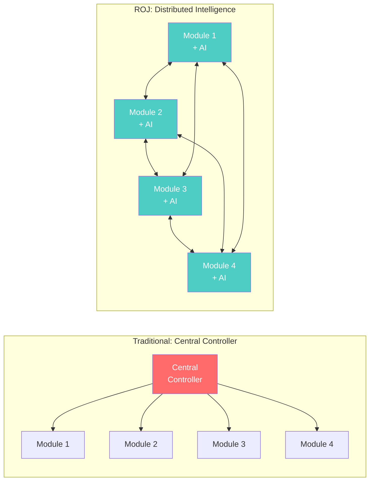

**Key Difference:**
- Traditional: Single point of failure, controller bottleneck
- ROJ: No single point of failure, direct peer communication

---

## 2. Module Roles & Leader Election

Modules dynamically take on roles. Leader election uses Raft consensus.

### Role Transitions

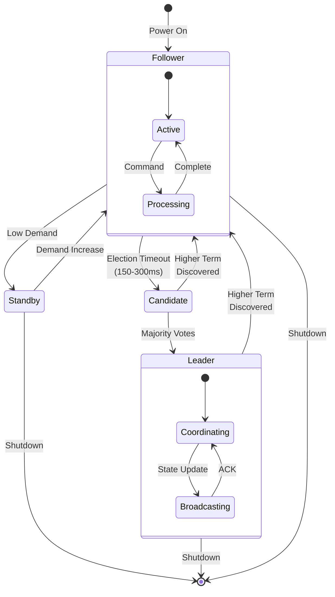

### Role Responsibilities

| Role | Count | Responsibilities |
|------|-------|-----------------|
| **Leader** | 1 | Aggregate system state, assign loads, coordinate |
| **Follower** | N-1 | Local optimization, report status, vote |
| **Standby** | 0+ | Reduced power, hot spare, ready to activate |

---

## 3. Communication Protocol

ROJ uses CAN-FD at 5 Mbps for all inter-module communication.

### Message Flow

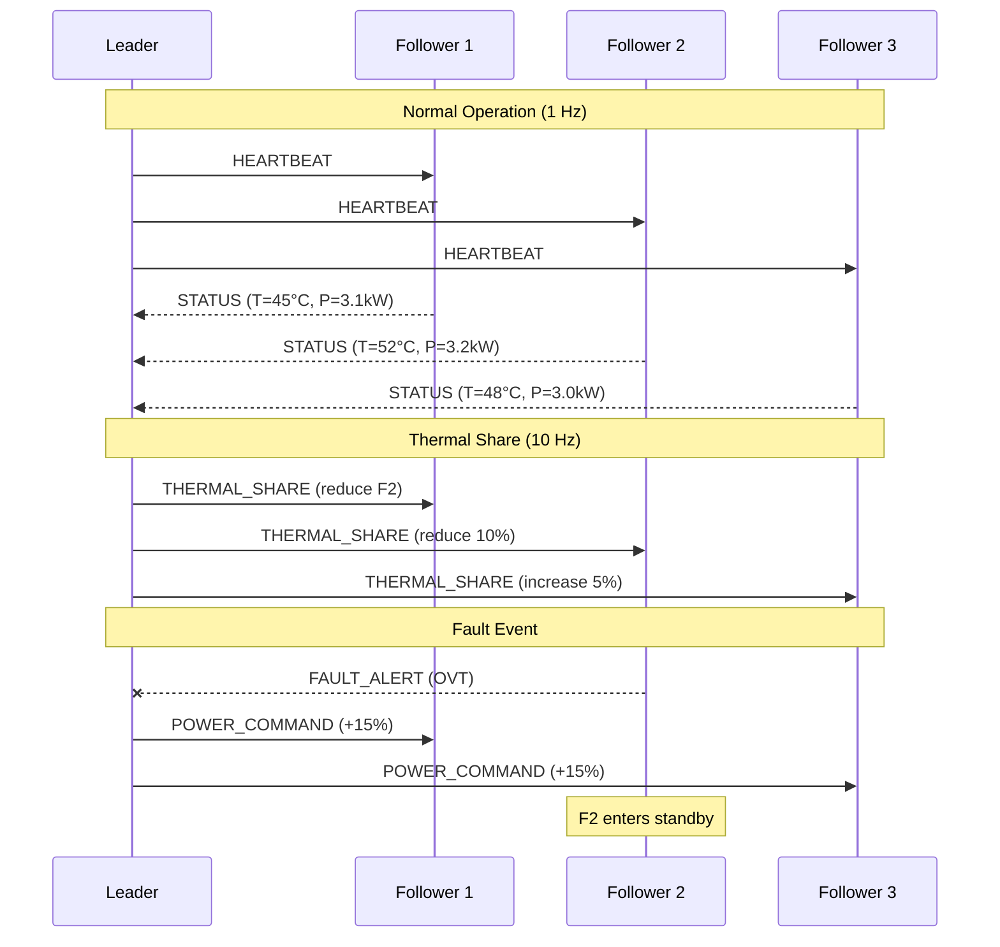

### Message Types

| Type | ID | Frequency | Priority | Purpose |
|------|------|-----------|----------|---------|
| `HEARTBEAT` | 0x1xx | 1 Hz | Medium | Presence detection |
| `POWER_COMMAND` | 0x2xx | On-demand | High | Power redistribution |
| `SYNC` | 0x0xx | 100 Hz | Highest | Time/grid sync |
| `THERMAL_SHARE` | 0x3xx | 10 Hz | Medium | Thermal coordination |
| `FAULT_ALERT` | 0x7FF | Event | Critical | Emergency notification |
| `ELECTION` | 0x010 | Event | High | Leader election |

---

## 4. Distributed Load Balancing

Two mechanisms work together: hardware-based droop control and AI-enhanced optimization.

### Droop Control (Hardware)

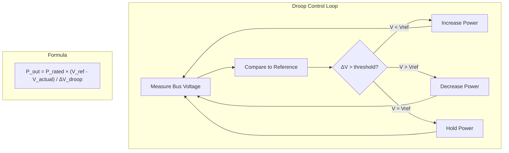

**Natural Self-Balancing:** Higher bus voltage → Higher power output. No communication needed.

### AI-Enhanced Optimization

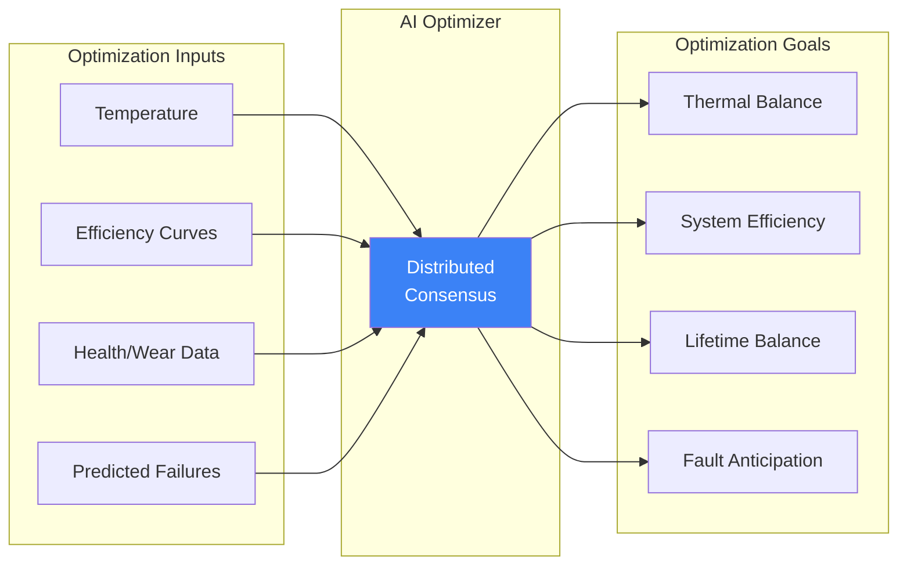

---

## 5. Thermal Migration

Heat "flows" from hot modules to cooler ones through load redistribution.

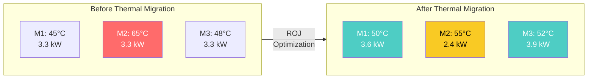

**Result:** Temperature spread reduced from 20°C to 5°C. Hot module protected from thermal stress.

---

## 6. Fault Tolerance & Self-Healing

### Module Lifecycle

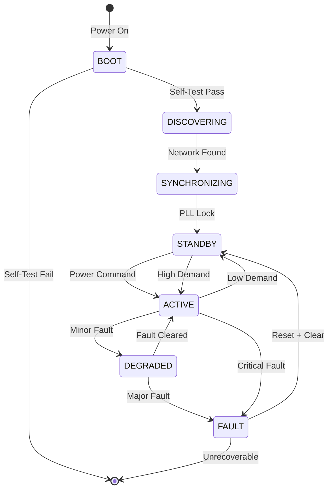

### Fault Response Sequence

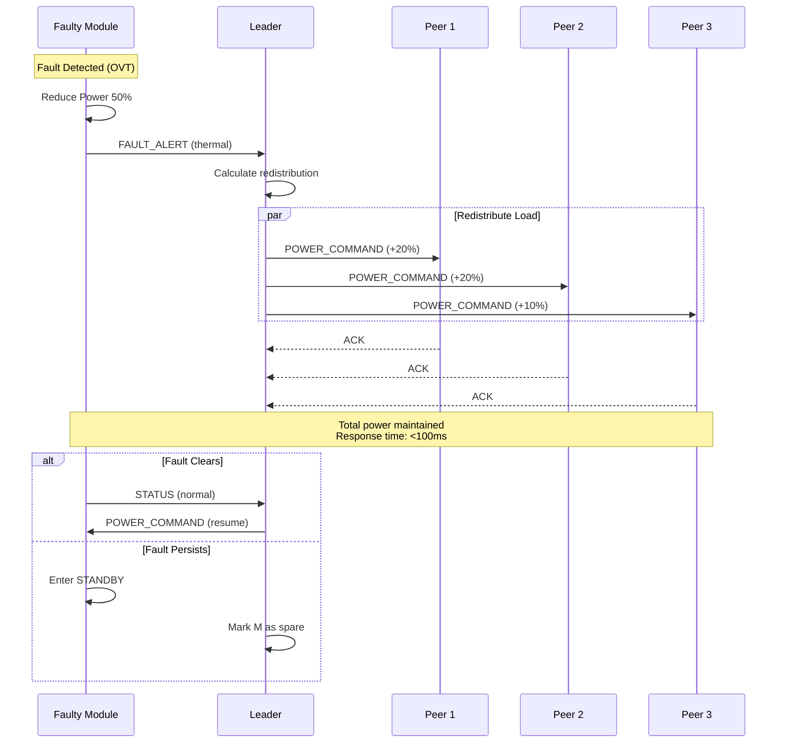

### Recovery Times

| Event | Detection | Response | Total |
|-------|-----------|----------|-------|
| Module fault | <1 ms | <100 ms | <100 ms |
| Leader failure | 150-300 ms | <100 ms | <400 ms |
| Communication loss | 50 ms | Immediate (droop) | <50 ms |

---

## 7. Scalability

ROJ scales from small systems to large installations using hierarchical coordination.

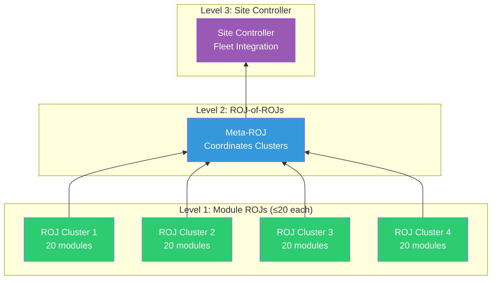

### Scaling Limits

| Level | Scope | Max Modules | Communication |
|-------|-------|-------------|---------------|
| **L1** | Single CAN segment | 20 | Direct CAN-FD |
| **L2** | CAN bridge | 100 | CAN-FD bridged |
| **L3** | Site-wide | 1000+ | Ethernet + CAN |

---

## 8. Emergent Behaviors

Simple local rules create complex optimal system behavior.

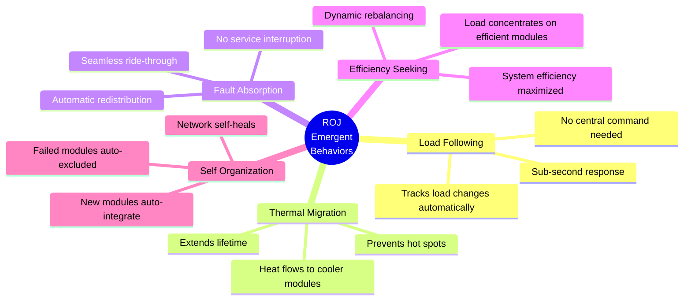

---

## 9. Battery ROJ Extension

ROJ extends to battery modules for fleet-wide coordination.

### Fleet Battery Pool

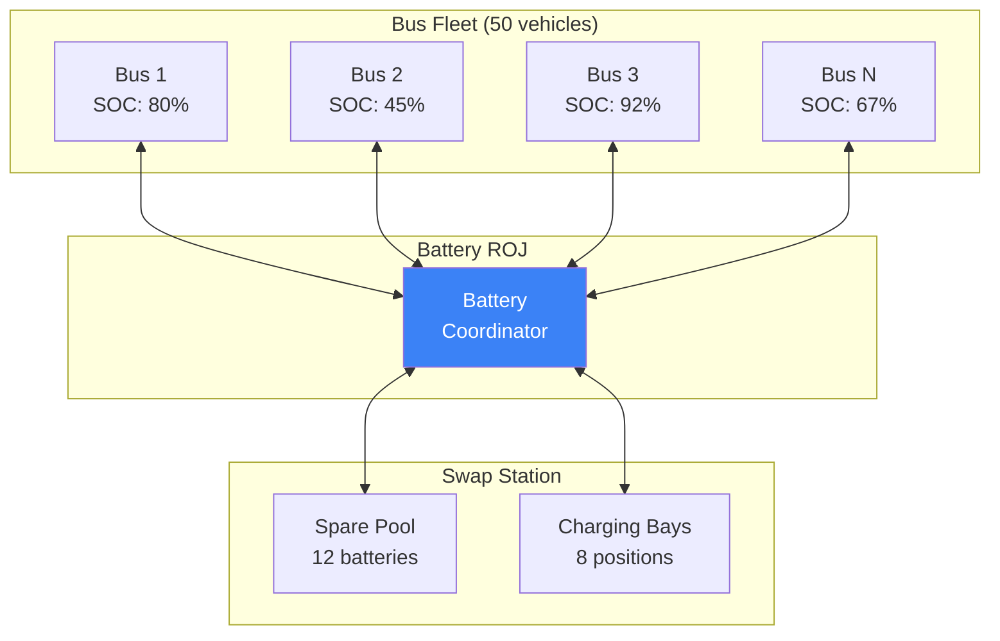

### V2G Virtual Power Plant

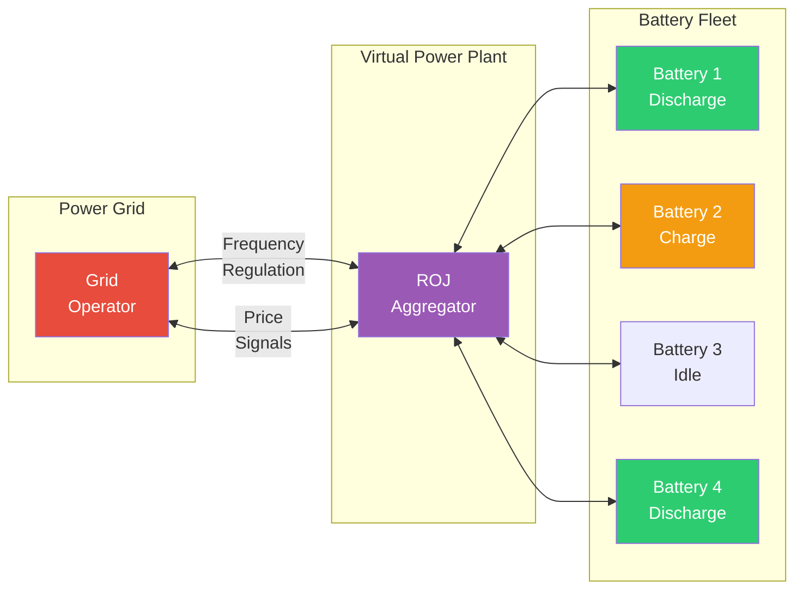

### Battery ROJ Benefits

| Behavior | Mechanism | Benefit |
|----------|-----------|---------|
| **SOC Equalization** | Cross-battery load sharing | Uniform wear |
| **Thermal Load Shifting** | Hot batteries rest | Extended life |
| **Health-Based Selection** | Degraded batteries avoid deep cycles | Protected investment |
| **Predictive Positioning** | Batteries pre-staged for routes | Faster swaps |
| **V2G Participation** | Fleet as virtual power plant | Revenue generation |

---

## 10. Bill of Materials (ROJ per module)

| Component | Part | Qty | Unit Price | Total |
|-----------|------|-----|-----------|-------|
| CAN-FD Transceiver | TJA1443 | 1 | €3.00 | €3.00 |
| Termination Resistor | 120Ω 0805 | 2 | €0.10 | €0.20 |
| CAN Connector | M12 5-pin | 2 | €5.00 | €10.00 |
| CAN Cable | 5m shielded | 1 | €10.00 | €10.00 |
| Status LED | RGB 3mm | 1 | €1.00 | €1.00 |
| ID Switch | 4-pos DIP | 1 | €1.00 | €1.00 |
| **TOTAL** | | | | **€25.20** |

---

## References

1. Ongaro, D., & Ousterhout, J. (2014). "In Search of an Understandable Consensus Algorithm" (Raft)
2. Guerrero, J.M., et al. (2011). "Hierarchical Control of Droop-Controlled AC and DC Microgrids"
3. IEEE 2030.5 - Smart Energy Profile 2.0
4. CAN in Automation (CiA) 301 - CANopen Application Layer

---

*Document: EK-VIS-001 | ROJ Visual Guide | v1.0*
